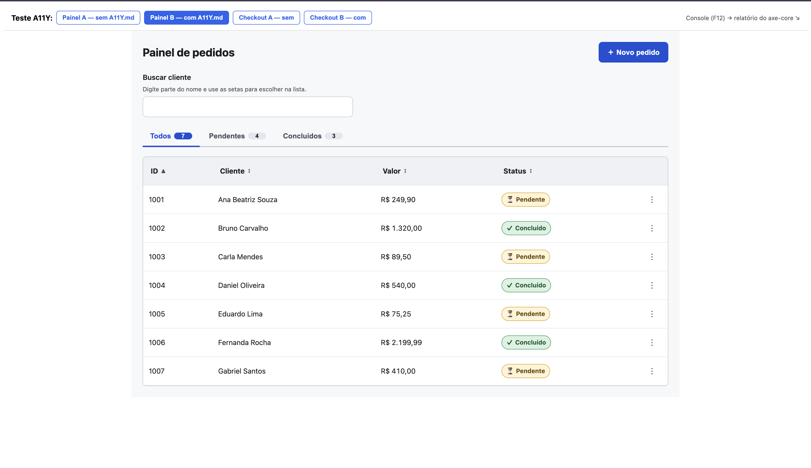

# Estudo prático: A11Y.md na geração de código com IA



Este repositório documenta um estudo experimental sobre o impacto de injetar o `A11Y.md` no contexto de um agente de IA durante a geração de interfaces React, avaliando se isso produz código mais acessível — e em que medida.

---

## Motivação

O `A11Y.md` propõe tratar acessibilidade desde o início do desenvolvimento, e não como uma etapa de validação no final. A hipótese testada foi: fornecer esse documento como contexto para a IA já na geração do código reduz significativamente a quantidade de barreiras de acessibilidade introduzidas?

---

## Estrutura do repositório

```
.
├── A11Y.md                  # Documento de diretrizes de acessibilidade usado como contexto
├── docs/
    └──RELATORIO-TESTE-A11Y.md  # Relatório completo com metodologia, resultados e conclusões
└── teste-a11y/              # Projeto Vite com as 4 telas geradas pela IA e axe-core plugado
    └── src/
        ├── Checkout.jsx         # Cenário simples — versão A (sem A11Y.md)
        ├── CheckoutScreen.jsx   # Cenário simples — versão B (com A11Y.md)
        ├── PainelA.jsx          # Cenário complexo — versão A (sem A11Y.md)
        └── PainelB.jsx          # Cenário complexo — versão B (com A11Y.md)
```

---

## Metodologia

Teste A/B controlado: mesma IA, mesmo prompt, única variável alterada foi a presença do `A11Y.md` no contexto.

A versão baseline (sem A11Y.md) foi gerada em **sessão separada e cega** — sem nenhum arquivo de acessibilidade por perto — para evitar que o modelo gerasse código acessível "sem querer", anulando a comparação.

Os resultados foram medidos por quatro métodos:
- **axe-core** — varredura automática no navegador
- **Lighthouse** — auditoria de acessibilidade via DevTools
- **Teste manual de teclado** — navegação exclusivamente por Tab, setas e Esc
- **VoiceOver** — teste com leitor de tela nativo do macOS para validar anúncios, ordem de leitura e experiência real com tecnologia assistiva

Dois cenários foram testados:
1. **Checkout** — formulário + modal (componente simples)
2. **Painel de Pedidos** — autocomplete + tabela ordenável + tabs + menu de ações + modal (componente complexo)

---

## Principais resultados

| Cenário | Impacto do A11Y.md |
|---|---|
| Checkout (simples) | Marginal — baseline já saía razoável; ganhos no modal, foco e contraste |
| Painel (complexo) | Significativo — baseline apresentou 6 barreiras que impediam uso por teclado/leitor de tela; versão com A11Y.md seguiu os padrões WAI-ARIA APG em todos os componentes |

**Achado importante:** ferramentas automáticas (axe-core, Lighthouse) identificaram apenas parte dos problemas. Os piores defeitos da versão baseline — autocomplete sem teclado, modal sem ESC, menu sem nome acessível — só apareceram no teste manual.

**Limitação:** mesmo a versão guiada pelo A11Y.md saiu com 1 bug crítico de ARIA (`aria-controls` apontando para um ID inexistente, causado por `useId()` sendo chamado em componentes diferentes). O A11Y.md é uma alavanca, não uma garantia.

---

## Como rodar o harness de teste

```bash
cd teste-a11y
npm install
npm run dev
```

Abra o navegador, navegue entre as telas e observe os relatórios do axe-core no console. Para o Lighthouse, use DevTools → aba Lighthouse → modo Snapshot → Desktop → Accessibility.

---

## Leitura recomendada

- `RELATORIO-TESTE-A11Y.md` — metodologia detalhada, tabelas comparativas e scores
